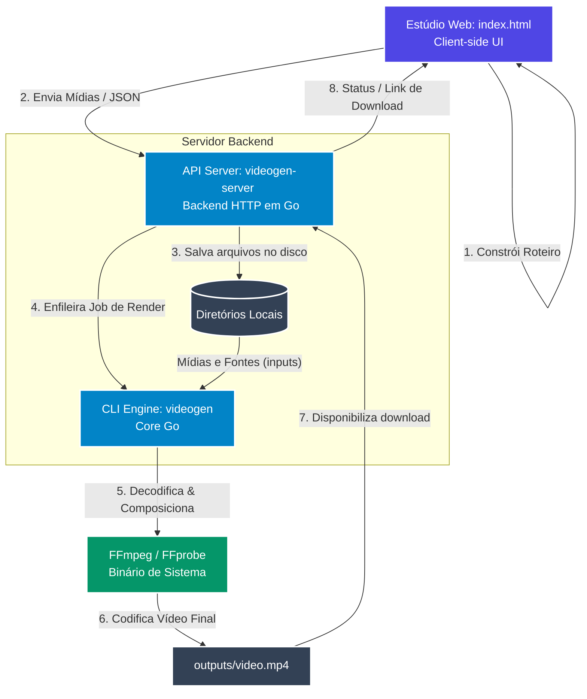

# Arquitetura do Sistema

O ecossistema **Crom Vide Gen Miniflow** é projetado seguindo uma arquitetura modular de três camadas. Isso garante que a criação visual da cena, o controle de rede e a renderização física pesada do arquivo de mídia rodem em processos desacoplados.

---

## 🗺️ Diagrama de Arquitetura

O fluxo de funcionamento geral dos componentes e sua comunicação pode ser resumido no seguinte fluxo:

---

## 🛠️ Descrição Detalhada das Camadas

### 1. Camada de Apresentação (Frontend) — `index.html`
* **Tecnologias**: HTML5, Tailwind CSS, JavaScript Moderno (ES6+).
* **Responsabilidades**:
  * Fornecer uma interface gráfica fluida e responsiva (Dark Mode premium).
  * Permitir ao usuário arrastar, soltar, criar e remover cards (cenas).
  * Executar a lógica prévia de estimativa de tempo de áudio baseada na contagem de caracteres/palavras.
  * Converter o estado dinâmico dos cards de tela para o modelo padrão JSON de template do motor.
  * Interagir com a API REST para enviar arquivos reais (`POST /api/upload`) e ordenar a renderização final (`POST /api/render`).

### 2. Camada de Controle e API — `videogen-server`
* **Tecnologias**: Go (Linguagem Go), Endpoints HTTP nativos/modulares.
* **Responsabilidades**:
  * Servir arquivos estáticos da interface web e arquivos renderizados de mídia.
  * Habilitar suporte a CORS para permitir integração com outros frontends.
  * Gerenciar o sistema de upload de arquivos de imagem/áudio/vídeo e salvá-los de forma estruturada.
  * Executar subprocessos `ffprobe` rápidos para retornar metadados das mídias enviadas (ex: duração exata de um áudio ou vídeo enviado).
  * Controlar uma fila de renderização concorrente em background usando *Go Channels* para evitar sobrecarga de CPU do servidor de hospedagem.

### 3. Camada do Motor de Renderização (Core) — `videogen`
* **Tecnologias**: Go nativo com forte concorrência e manipulação direta de processos.
* **Responsabilidades**:
  * Realizar o processo de bootstrapper na primeira inicialização (extraindo fontes de texto e estruturas padrão de exemplo).
  * Validar a integridade estrutural e de tipos do JSON do template recebido.
  * Dividir a timeline geral em threads de renderização separadas (uma thread/worker por cena ou grupos de quadros para acelerar o processo).
  * Orquestrar as chamadas do **FFmpeg** em baixo nível, gerando os comandos complexos de filtragem de vídeo (`filter_complex`), sobreposição de imagens (`overlay`), dimensionamento (`scale`), legendagem (`drawtext`) e mixagem de canais de áudio.

---

## 💾 Organização do Sistema de Arquivos

Ao rodar os binários, a seguinte topologia de arquivos é respeitada para compartilhamento de dados entre a API, CLI e o Frontend:

* `/assets/fonts/`: Fontes TTF (TrueType) utilizadas para desenhar as legendas dinâmicas no vídeo (Roboto extraída automaticamente).
* `/templates/examples/`: Templates JSON modelo salvos e gerenciados.
* `/tmp/uploads/`: Arquivos brutos de imagens, músicas e vídeos curtos enviados pelo usuário.
* `/outputs/`: Vídeos MP4 codificados prontos para distribuição e exibição.
